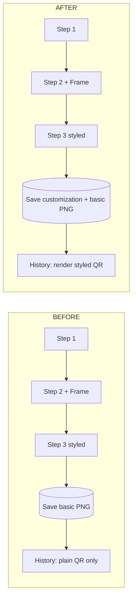
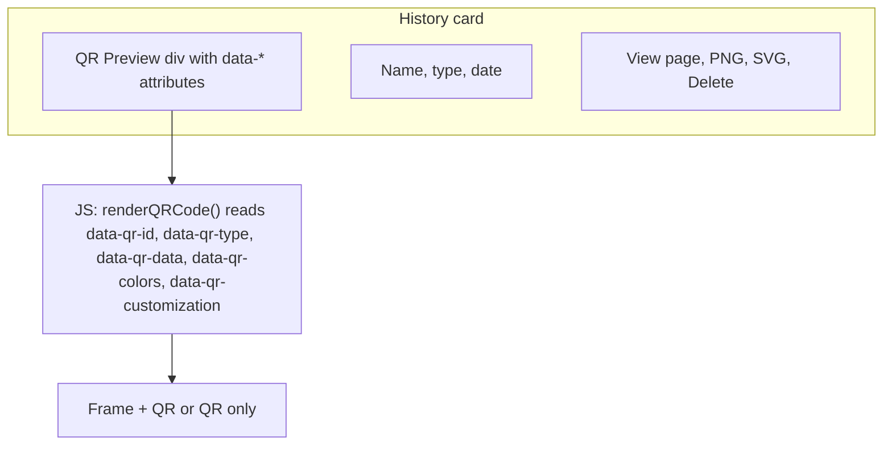
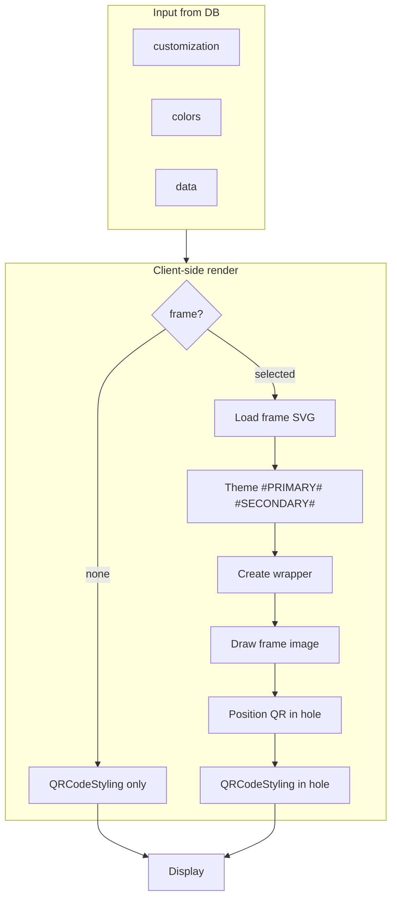

# Visual Explanation: QR History Fix

This document explains **what was wrong**, **what we fixed**, and **how it works** using diagrams and step-by-step flows.

---

## 1. Before vs After (High Level)

```
┌─────────────────────────────────────────────────────────────────────────────┐
│  BEFORE (Problem)                                                           │
├─────────────────────────────────────────────────────────────────────────────┤
│                                                                             │
│   Step 1          Step 2              Step 3              History           │
│   ┌─────┐        ┌─────┐             ┌─────┐             ┌─────┐            │
│   │ Form │  ──►  │ QR  │  ──► Save   │ Full │  ──►       │ Basic│           │
│   │ Data │       │ +   │      only   │ styled│            │ QR   │  ❌       │
│   └─────┘        │Frame│      basic  │ QR   │             │ only │           │
│                  │     │      PNG    │      │             └─────┘            │
│                  └─────┘             └─────┘                  │             │
│                       │                    │                   │             │
│                       │                    └── User sees       │             │
│                       │                         nice QR        │             │
│                       │                         but history    │             │
│                       │                         shows plain!   │             │
│                       └── Frame/colors NOT saved to DB         │             │
│                                                                             │
└─────────────────────────────────────────────────────────────────────────────┘

┌─────────────────────────────────────────────────────────────────────────────┐
│  AFTER (Fixed)                                                              │
├─────────────────────────────────────────────────────────────────────────────┤
│                                                                             │
│   Step 1          Step 2              Step 3              History              │
│   ┌─────┐        ┌─────┐             ┌─────┐             ┌─────┐            │
│   │ Form │  ──►  │ QR  │  ──► Save   │ Full │  ──►        │ Full │            │
│   │ Data │       │ +   │      full   │ styled│             │ styled│  ✅     │
│   └─────┘        │Frame│      custom │ QR   │              │ QR   │            │
│                  │     │      (frame, │      │              │ same │            │
│                  └─────┘      colors) └─────┘              │ as   │            │
│                       │                    │               │Step 3│            │
│                       │                    │               └─────┘            │
│                       │                    └── Same look everywhere           │
│                       └── Frame, colors, logo SAVED in customization         │
│                                                                             │
└─────────────────────────────────────────────────────────────────────────────┘
```

---

## 2. What Gets Saved Now

```
┌──────────────────────────────────────────────────────────────────┐
│  QR Code Record (database)                                        │
├──────────────────────────────────────────────────────────────────┤
│  id, type, name, data, colors, customization, qr_image_path        │
│                                                                   │
│  customization (JSON) now includes:                                │
│  ┌─────────────────────────────────────────────────────────────┐ │
│  │  pattern         "square" | "circle" | "rounded"             │ │
│  │  corner_style    "square" | "rounded" | "extra-rounded"       │ │
│  │  corner_dot_style "square" | "circle" | "rounded"            │ │
│  │  frame           "none" | "standard-border" | "review-us" ...  │ │
│  │  logo_url        data:image/... (base64) or null              │ │
│  │  review_us_config  (only if frame === "review-us")            │ │
│  │    color, text_color, line1, line2, line3, icon, logo_url    │ │
│  └─────────────────────────────────────────────────────────────┘ │
└──────────────────────────────────────────────────────────────────┘
```

---

## 3. Create Flow (Step 1 → Step 2 → Step 3)

```
                    USER
                      │
                      ▼
        ┌─────────────────────────┐
        │  Step 1: Form (type,   │
        │  name, content, etc.)   │
        └───────────┬────────────┘
                     │ Next
                     ▼
        ┌─────────────────────────┐
        │  Step 2: Design         │
        │  • Frame (none/border/   │
        │    review-us/...)        │
        │  • Pattern (square/     │
        │    circle/rounded)       │
        │  • Corners               │
        │  • Colors (primary/      │
        │    secondary)           │
        │  • Optional logo        │
        └───────────┬──────────────┘
                     │ Next → API
                     ▼
        ┌─────────────────────────┐
        │  Backend: store()       │
        │  • Save data, colors    │
        │  • Save customization   │
        │    (frame, logo_url,    │
        │     review_us_config)   │
        │  • Generate basic PNG  │
        │    (qr_image_path)      │
        └───────────┬──────────────┘
                     │
                     ▼
        ┌─────────────────────────┐
        │  Step 3: Preview       │
        │  (client-side)          │
        │  • Build frame SVG      │
        │  • QRCodeStyling draws  │
        │    QR in frame          │
        │  • Same as user saw    │
        │    in Step 2            │
        └─────────────────────────┘
```

---

## 4. History Page Flow

```
        User opens /qr-codes/history
                      │
                      ▼
        ┌─────────────────────────┐
        │  Server: history()     │
        │  • Load QR codes        │
        │  • Pass frameConfig     │
        │  • Render cards with    │
        │    data-* attributes    │
        └───────────┬──────────────┘
                     │
                     ▼
        ┌─────────────────────────┐
        │  Browser receives HTML  │
        │  Each card has:         │
        │  data-qr-id             │
        │  data-qr-type           │
        │  data-qr-data           │
        │  data-qr-colors         │
        │  data-qr-customization  │
        └───────────┬──────────────┘
                     │
                     ▼
        ┌─────────────────────────┐
        │  JS: renderQRCode()     │
        │  for each card          │
        └───────────┬──────────────┘
                     │
         ┌──────────┴──────────┐
         ▼                      ▼
   frame === 'none'?      frame !== 'none'?
         │                      │
         ▼                      ▼
   ┌─────────────┐      ┌─────────────────────┐
   │ QRCodeStyling│      │ 1. Load frame SVG   │
   │ .append()   │      │ 2. Theme (#PRIMARY#  │
   │ (QR only)   │      │    #SECONDARY#)      │
   └─────────────┘      │ 3. Create wrapper   │
                        │ 4. Put frame img   │
                        │ 5. Put QR in hole  │
                        │ 6. QRCodeStyling    │
                        │    .append(qrInFrame)│
                        └─────────────────────┘
```

---

## 5. Download Flow

```
        User clicks "PNG" or "SVG" in History
                      │
                      ▼
        ┌─────────────────────────┐
        │  GET /qr-codes/{id}/    │
        │  download/{format}      │
        └───────────┬──────────────┘
                     │
                     ▼
        ┌─────────────────────────┐
        │  Server: download()     │
        │  • Load QR code         │
        │  • Return view          │
        │    (download.blade.php) │
        │  with qrCode, format    │
        └───────────┬──────────────┘
                     │
                     ▼
        ┌─────────────────────────┐
        │  Download page loads    │
        │  • Shows "Preparing..." │
        │  • Inline script runs   │
        └───────────┬──────────────┘
                     │
                     ▼
        ┌─────────────────────────┐
        │  generateAndDownload() │
        │  • Same config as       │
        │    history (frame,     │
        │    colors, pattern)     │
        │  • Size = 1000px       │
        └───────────┬──────────────┘
                     │
         ┌──────────┴──────────┐
         ▼                      ▼
   No frame                 With frame
         │                      │
         ▼                      ▼
   QRCodeStyling          Canvas composite:
   .download()            1. Draw frame image
   (PNG or SVG)           2. Draw QR canvas
                          3. canvas.toBlob()
                          4. Trigger download
```

---

## 6. Component Diagram

```
                    ┌─────────────────────────────────────────┐
                    │           QR Code Generator App          │
                    └─────────────────────────────────────────┘
                                         │
         ┌───────────────────────────────┼───────────────────────────────┐
         │                               │                               │
         ▼                               ▼                               ▼
┌─────────────────┐           ┌─────────────────┐           ┌─────────────────┐
│  Create Page    │           │  History Page   │           │  Download Page  │
│  (create.blade) │           │ (history.blade) │           │(download.blade) │
├─────────────────┤           ├─────────────────┤           ├─────────────────┤
│ • Step 1 form   │           │ • List of cards │           │ • Standalone   │
│ • Step 2 design │           │ • Each card:    │           │ • Loads QR     │
│   - Frame pick  │           │   - data-* attrs │           │   data from     │
│   - QR preview  │           │   - renderQRCode│           │   server        │
│ • Step 3 final  │           │     (JS)        │           │ • Same frame/  │
│   - generateStep│           │ • Frame config  │           │   QR logic     │
│     3CustomizedQR│           │   from server  │           │ • Triggers     │
│ • Submit → API  │           │ • PNG/SVG links │           │   file download │
└────────┬────────┘           └────────┬────────┘           └────────┬────────┘
         │                              │                             │
         │  POST /qr-codes              │  GET /history                │  GET /download
         │  (frame, colors,             │  (frameConfig)               │  (id, format)
         │   customization)             │                             │
         ▼                              ▼                             ▼
┌─────────────────────────────────────────────────────────────────────────────┐
│                         QrCodeController                                      │
│  store() → save customization (frame, logo_url, review_us_config)            │
│  history() → frameConfig for view                                            │
│  download() → download view with qrCode                                       │
└─────────────────────────────────────────────────────────────────────────────┘
                                         │
                                         ▼
┌─────────────────────────────────────────────────────────────────────────────┐
│                         QrCodeService                                         │
│  generate(), regenerateQrCode() → basic PNG (qr_image_path)                   │
│  getFrameConfig(frameId) → { url, qrLeft, qrTop, qrWidth, qrHeight, ... }     │
└─────────────────────────────────────────────────────────────────────────────┘
                                         │
                                         ▼
┌─────────────────────────────────────────────────────────────────────────────┐
│                         Database (qr_codes)                                    │
│  type, name, data, colors, customization, qr_image_path                       │
└─────────────────────────────────────────────────────────────────────────────┘
```

---

## 7. Frame + QR Layout (Visual)

```
  When frame is selected (e.g. "standard-border"):

  ┌─────────────────────────────────────────┐
  │              FRAME SVG                   │
  │  (themed with primary/secondary colors)  │
  │                                         │
  │     ┌─────────────────────────┐         │
  │     │                         │         │
  │     │    QR CODE (hole)       │         │  ← qrLeft%, qrTop%
  │     │    drawn by             │         │    qrWidth%, qrHeight%
  │     │    QRCodeStyling         │         │
  │     │                         │         │
  │     └─────────────────────────┘         │
  │                                         │
  └─────────────────────────────────────────┘

  Dimensions:
  • holePx = 160 (history) or 1000 (download)
  • totalWidth  = holePx / (qrWidth/100)
  • totalHeight = totalWidth * (frameHeight/frameWidth)
  • QR is positioned at (qrLeft%, qrTop%) with size (qrWidth%, qrHeight%)
```

---

## 8. Data Flow Summary

```
  CREATE (Save)
  ─────────────
  Form (frame, colors, pattern, logo)  ──►  store()  ──►  DB
       (customization object)                  │
                                               └──► customization JSON

  HISTORY (Display)
  ─────────────────
  DB (qr_codes + customization)  ──►  history view  ──►  HTML + data-*
                                                              │
                                                              └──► JS renderQRCode()
                                                                       │
                                                                       └──► Frame + QRCodeStyling

  DOWNLOAD
  ────────
  DB  ──►  download view (qrCode, format)  ──►  generateAndDownload()
                                                    │
                                                    └──► Canvas/QRCodeStyling → file
```

---

## 9. Quick Reference: Where Is What?

| What              | Where it lives        | Used by                    |
|-------------------|-----------------------|----------------------------|
| Frame list & sizes| `QrCodeService::getFrameConfig()` + create.blade `FRAME_CONFIG` | Create, History, Download |
| User's frame choice | DB `customization.frame`     | History, Download          |
| User's colors    | DB `colors`           | History, Download          |
| User's pattern/corners | DB `customization`   | History, Download          |
| Logo (data URL)   | DB `customization.logo_url` | History, Download     |
| Review-us text/icon | DB `customization.review_us_config` | History, Download |
| Basic PNG (legacy)| DB `qr_image_path`    | Optional fallback          |

---

## 10. Mermaid Diagrams (for GitHub / GitLab / VS Code)

### Before vs After



### Save → History → Download

```mermaid
sequenceDiagram
    participant User
    participant Create as Create Page
    participant API as Controller
    participant DB as Database
    participant History as History Page
    participant Download as Download Page

    User->>Create: Fill form + pick frame
    Create->>API: POST /qr-codes (frame, colors, customization)
    API->>DB: Save qr_codes row
    DB-->>API: OK
    API-->>Create: qr_code_id, preview_url

    User->>History: Open history
    History->>API: GET /qr-codes/history
    API->>DB: Load qr_codes + frameConfig
    DB-->>API: rows
    API-->>History: view + frameConfig
    History->>History: JS: renderQRCode() for each card

    User->>History: Click PNG
    History->>Download: GET /qr-codes/1/download/png
    Download->>API: download view
    API-->>Download: qrCode, format
    Download->>Download: JS: generateAndDownload()
    Download->>User: File download
```

### History card structure



### Frame + QR rendering



---

*End of visual explanation.*
